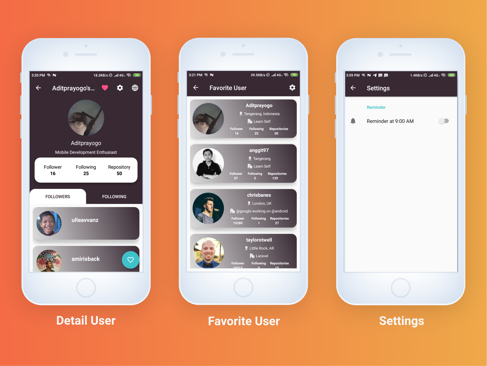

# Dicoding Submission: Belajar Fundamental Aplikasi Android
   

## Apps Feature :
- Search User On Github
- Reminder At 9:00 AM
- Favorite User
- Delete Favorite User
- Localization
- Consumer

## Clean Architecture :

    

## Demo :

    

    

    

## Libraries Used
- Retrofit2(https://square.github.io/retrofit/)
- Material Design
- Room
- Coroutines
- ViewModel
- LiveData
- Glide
- Shimmer
- Dagger2
- OkHttp
- GSON
- Preferences

