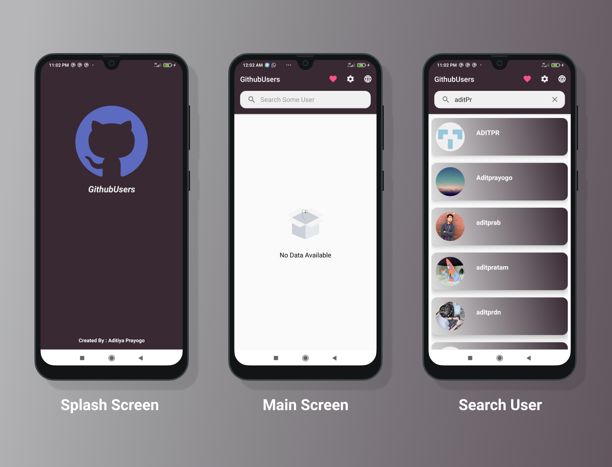
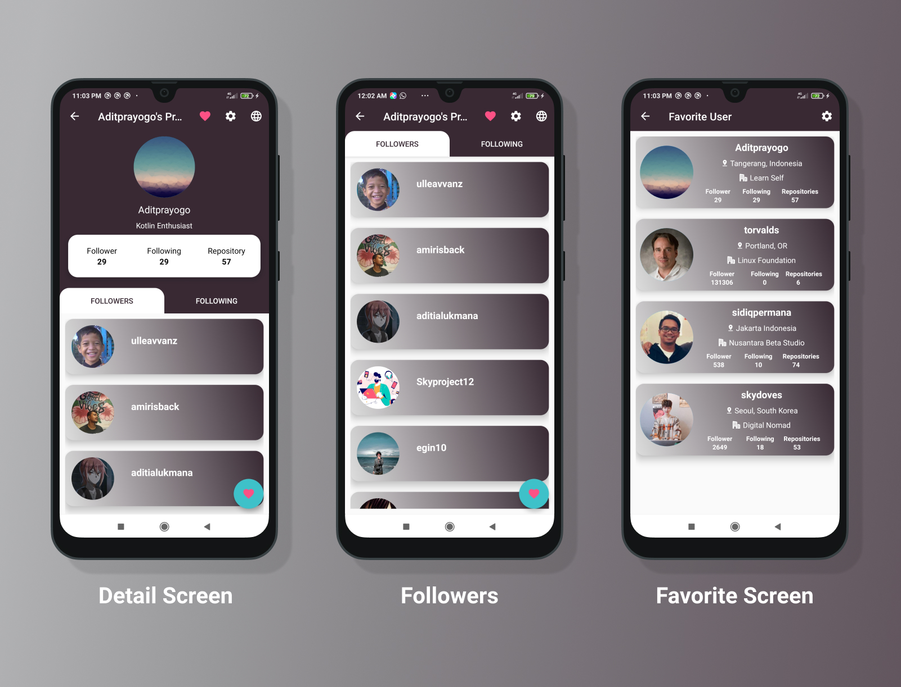

# Dicoding Submission: Belajar Fundamental Aplikasi Android
 [](http://developer.android.com/index.html) [](http://kotlinlang.org) [](https://developer.android.com/studio/releases/gradle-plugin)

## Apps Feature :
- Search User On Github
- Reminder At 9:00 AM
- Add Favorite User
- Delete Favorite User
- User Favorite
- Localization
- Content Provider

## Clean Architecture :
<p align="center">
    
</p>

# What is Clean Architecture ?

Clean architecture is a software design philosophy that separates the elements of a design into ring levels. An important goal of clean architecture is to provide developers with a way to organize code in such a way that it encapsulates the business logic but keeps it separate from the delivery mechanism.

# Layers
- **Domain** - Contains the business logic of the application. It is the individual and innermost module. It’s a complete java module.
- **Data** It includes the domain layer. It would implement the interface exposed by domain layer and dispenses data to app
- **Presentation** - A layer that interacts with the UI, mainly Android Stuff like Activities, Fragments, ViewModel, etc. It would include both domain and data layers.


## How to Use This App :
Generate your token in here https://github.com/settings/tokens and replace with your token in **build.gradle**
```kotlin

    defaultConfig {
            ---
            ---
            buildConfigField "String", "GITHUB_TOKEN", "\"REPLACE WITH YOUR GITHUB TOKEN\""

        }
```

## Demo :

<p align="center">
    
</p>

<p align="center">
    
</p>


## Built With
- [Kotlin](https://kotlinlang.org/) - First class and official programming language for Android development.
- [Coroutines](https://kotlinlang.org/docs/reference/coroutines-overview.html) - Is light wight threads for asynchronous programming
- [Android Architecture Components](https://developer.android.com/topic/libraries/architecture) - Collection of libraries that help you design robust, testable, and maintainable apps.
   - [LiveData](https://developer.android.com/topic/libraries/architecture/livedata) - Data objects that notify views when the underlying database changes.
   - [ViewModel](https://developer.android.com/topic/libraries/architecture/viewmodel) - Stores UI-related data that isn't destroyed on UI changes.
   - [ViewBinding](https://developer.android.com/topic/libraries/view-binding) - Generates a binding class for each XML layout file present in that module and allows you to more easily write code that interacts with views.
   - [Room](https://developer.android.com/topic/libraries/architecture/room) - SQLite object mapping library.
- [Dependency Injection](https://developer.android.com/training/dependency-injection)
- [Retrofit](https://square.github.io/retrofit/) - A type-safe HTTP client for Android and Java.
- [Dagger2](https://google.github.io/dagger/) For Depedency Injection (Will Migrate to Hilt later)
- [Shimmer](https://github.com/facebook/shimmer-android)Android library that provides an easy way to add a shimmer effect to any view in your Android app
- [OkHttp](http://square.github.io/okhttp/) An HTTP & HTTP/2 client for Android and Java applications.
- [Gson](https://github.com/google/gson) A Java serialization/deserialization library to convert Java Objects into JSON and back
- [Glide](https://github.com/bumptech/glide) An image loading and caching library for Android focused on smooth scrolling
- [Lottie-Android](https://github.com/airbnb/lottie-android) JSON-based animation file format that enables designers to ship animations on any platform as easily as shipping static assets.
- [Material Design](https://material.io/develop/android/docs/getting-started)

## How to Support me ?
> Just Follow my Github and **star** this repo


# License
```

   Copyright © 2020 Aditiya Ihzar Eka Prayogo

   Licensed under the Apache License, Version 2.0 (the "License");
   you may not use this file except in compliance with the License.
   You may obtain a copy of the License at

       http://www.apache.org/licenses/LICENSE-2.0

   Unless required by applicable law or agreed to in writing, software
   distributed under the License is distributed on an "AS IS" BASIS,
   WITHOUT WARRANTIES OR CONDITIONS OF ANY KIND, either express or implied.
   See the License for the specific language governing permissions and
   limitations under the License.

```


